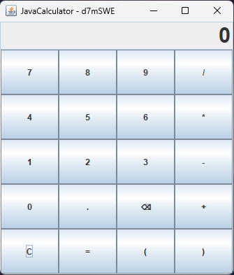

# 🧮 Java Calculator

A clean, desktop calculator application built with **Java Swing**.

---

## 📱 Calculator Layout



---

## ✨ Features

- ➕ Basic operations (+, -, *, /)
- 📦 Parentheses support
- 🔢 Decimal numbers
- ⌫ Backspace & C clear functions

---

## 📋 Requirements

- ☕ Java 8 or higher

---

## 🚀 How to Run

### Option 1: Double Click
Simply double-click `JavaCalculator.jar`

### Option 2: Command Line
```bash
java -jar JavaCalculator.jar